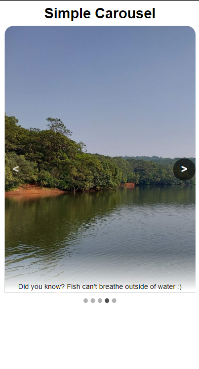

# Simple carousel

In this project, I have created simple carousel application used to show horizontal slideshow.

## Introduction :book:

In many web-applications, we notice that there are simple slideshow(_or carousel_) which shows useful or important information and any highlights inside page in it.We can slide throught it to see all of the highlights. This way, user's time can be saved by not going through whole page only to know what that _page/site_ contains.

## What is this project about :question:

This app contains 5 simple images and those are shown as slideshow. User can click on `>` or `<` to navigate through slides and get some information. Below slideshow block, there contains indicator for slides.

## My work :toolkit:

So, I used 5 images and developed carousel/slideshow of images. Images are imported from local storage and description for those is also added.\
I also used **css-animations** to add transition effect when slide changes, this way UX got improved. "useRef()" hook is used to track reference to slides, so that we can perform some action and get the work done. Same for indicator also.Indicator reflects latest position of slide at which we are now and jump to any specific position can also be made by clicking on particular "dot"

## Developed using :rocket:

- Language: Javascript
- Frontend: Reactjs

## Output :baby:

- **_Desktop_** :desktop_computer:\
  .png>)\
  .png>)
- **_Mobile_** :iphone:\
  

  ## Future scope :star:

  :white_check_mark: Improvement to layout can be made\
  :white_check_mark: Flexibility to support any size of image can be added\
  :white_check_mark: UX research can also be done to improve animations resulting in more engagement\
  Don't stop here, go on...

# Wrapping up :scroll:

**_You came here, there should be some reason but more than it is that you are here. What else I want, that's huge achievement.Thanks for approaching to this repo :orange_heart: :smiley:_**
